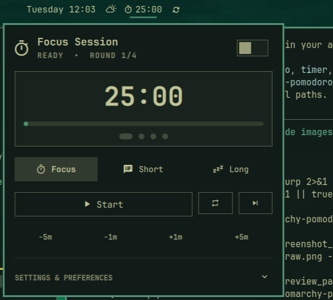
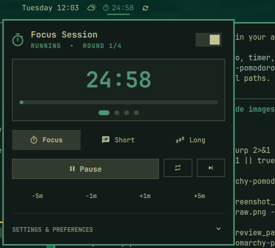
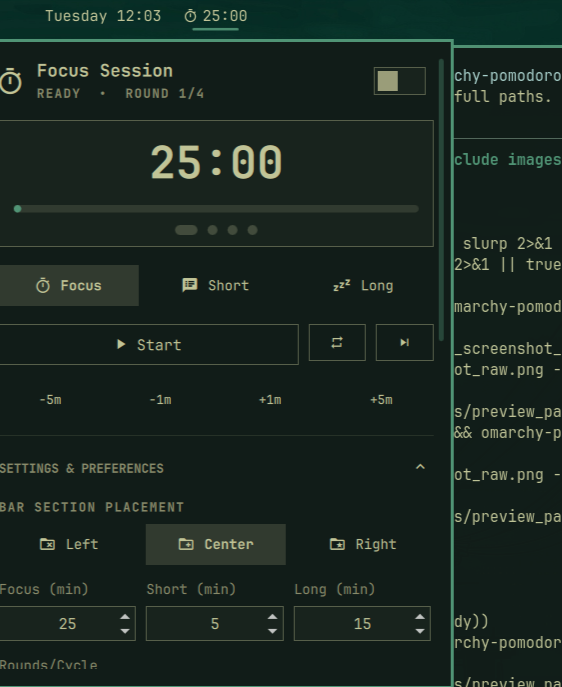

# Omarchy Pomodoro 🍅

A beautiful, fully integrated Pomodoro focus timer plugin for **[Omarchy Linux](https://omarchy.org/)**.

Designed specifically for the Omarchy status bar and Quickshell desktop environment, following Omarchy's design language, typography, and interactive keyboard/mouse controls.

<div align="center">
  
  &nbsp;&nbsp;
  
</div>

<p align="center">
  <em>Live status bar timer, interactive popup panel, cycle tracking, and full customization.</em>
</p>

---

## ✨ Features

- **Status Bar Widget**:
  - Live countdown timer (`󰔛 24:59`) directly on the Omarchy bar.
  - Phase indicator icons: `󰔛` Focus, `󰚢` Short Break, `󰒲` Long Break.
  - State highlighting: active accent color when running, dimmed when paused.
  - Interactive mouse actions:
    - **Left Click**: Open / close rich popup panel.
    - **Right Click**: Quick Start / Pause without opening popup.
    - **Middle Click**: Skip to next phase.
    - **Scroll Wheel**: Adjust remaining time ±1 minute on the fly.

- **Bar Placement & Display Customization**:
  - **Live Section Switcher**: Move widget to `Left`, `Center`, or `Right` directly from the popup settings UI or CLI.
  - **Show / Hide Timer Digits**: Toggle displaying countdown digits on the bar.
  - **Show / Hide Phase Icon**: Toggle displaying the phase glyph on the bar.
  - **Hide on Bar When Idle**: Automatically hide the widget from the bar when stopped, appearing only when active.

- **Apps Menu & Launcher Integration**:
  - Appears in your application launcher (Walker, Rofi, Omarchy Menu) as **"Omarchy Pomodoro"**.
  - Search keywords: `pomodoro`, `timer`, `focus`, `productivity`, `clock`.

- **Rich Popup Panel**:
  - **Hero Header**: Displays current phase, cycle status (`ROUND 2/4`), and quick start/pause toggle.
  - **Large Digital Clock**: Bold readout of remaining time.
  - **Progress Bar**: Smooth progress track indicating completion.
  - **Pomodoro Cycle Dots**: Visual indicator of rounds completed in the current cycle.
  - **Quick Phase Switcher**: One-click switching between **Focus (25m)**, **Short Break (5m)**, and **Long Break (15m)**.
  - **Quick Time Adjusters**: `-5m`, `-1m`, `+1m`, `+5m` buttons.
  - **Customizable Preferences**:
    - Focus duration (1–120 minutes)
    - Short break duration (1–60 minutes)
    - Long break duration (1–90 minutes)
    - Rounds per cycle (1–12 rounds)
    - Bar section placement (`Left`, `Center`, `Right`)
    - Bar display options (timer digits, icon, hide when idle)
    - Auto-start breaks toggle
    - Auto-start focus sessions toggle
    - Desktop notifications toggle
    - Sound chime toggle

<div align="center">
  
  <p><em>Settings & Preferences drawer with custom durations and bar placement</em></p>
</div>

- **Desktop Notifications & Sound**:
  - Sends native `omarchy-notification-send` toasts with glyphs when sessions or breaks end.
  - Plays clean audio alert chime on completion.

- **Keyboard Navigation & Hotkeys**:
  - `Space`: Start / Pause
  - `R`: Reset current timer
  - `S`: Skip to next phase
  - `1`: Switch to Focus mode
  - `2`: Switch to Short Break mode
  - `3`: Switch to Long Break mode
  - `+` / `=`: Add 1 minute
  - `-`: Subtract 1 minute
  - `Esc`: Close popup

- **CLI & IPC Integration**:
  - Included `omarchy-pomodoro` CLI script for controlling the timer from terminals or Hyprland keybindings.

---

## 📦 Installation

### Option 1: Using Omarchy CLI (Git)

```bash
omarchy plugin add https://github.com/rodrigojacarei/omarchy-pomodoro.git --enable
```

### Option 2: Local Development / Manual Installation

Clone or copy the folder to your Omarchy plugins directory:

```bash
mkdir -p ~/.config/omarchy/plugins ~/.local/bin ~/.local/share/applications
cp -r /path/to/omarchy-pomodoro ~/.config/omarchy/plugins/omarchy-pomodoro
ln -sf ~/.config/omarchy/plugins/omarchy-pomodoro/bin/omarchy-pomodoro ~/.local/bin/omarchy-pomodoro
cp ~/.config/omarchy/plugins/omarchy-pomodoro/omarchy-pomodoro.desktop ~/.local/share/applications/
omarchy-shell shell rescanPlugins
omarchy plugin enable omarchy-pomodoro --section center
```

---

## ⌨️ Hyprland Keybindings (Optional)

You can bind hotkeys to control the timer in `~/.config/hypr/bindings.conf`:

```ini
# Toggle Pomodoro popup panel
bind = SUPER, P, exec, omarchy-pomodoro toggle

# Start/Pause Pomodoro timer
bind = SUPER SHIFT, P, exec, omarchy-pomodoro play-pause
```

---

## 🛠️ CLI Commands

```bash
omarchy-pomodoro toggle         # Open or close the panel
omarchy-pomodoro start          # Start timer
omarchy-pomodoro pause          # Pause timer
omarchy-pomodoro play-pause     # Toggle start/pause
omarchy-pomodoro reset          # Reset timer
omarchy-pomodoro skip           # Skip to next phase
omarchy-pomodoro focus          # Switch to Focus mode
omarchy-pomodoro short-break    # Switch to Short Break
omarchy-pomodoro long-break     # Switch to Long Break
omarchy-pomodoro +1m            # Add 1 minute
omarchy-pomodoro -1m            # Subtract 1 minute
omarchy-pomodoro unhide         # Always show widget on bar
omarchy-pomodoro move left      # Move widget to left section
omarchy-pomodoro move center    # Move widget to center section
omarchy-pomodoro move right     # Move widget to right section
```

---

## 📄 License

MIT License. See [LICENSE](LICENSE) for details.
